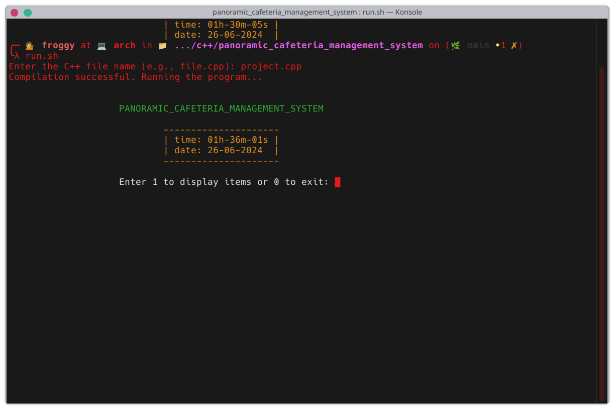
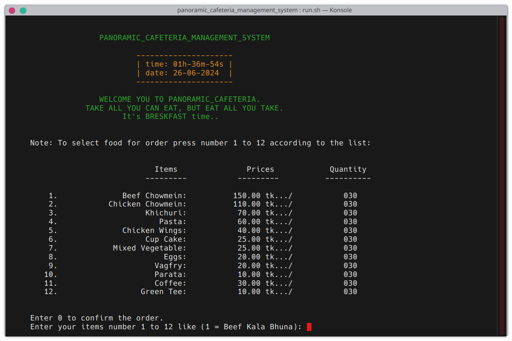
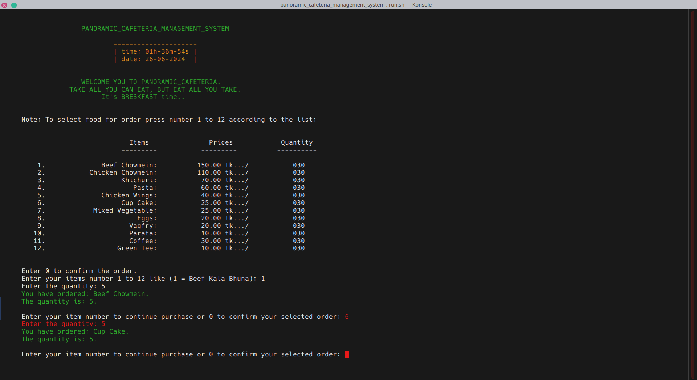
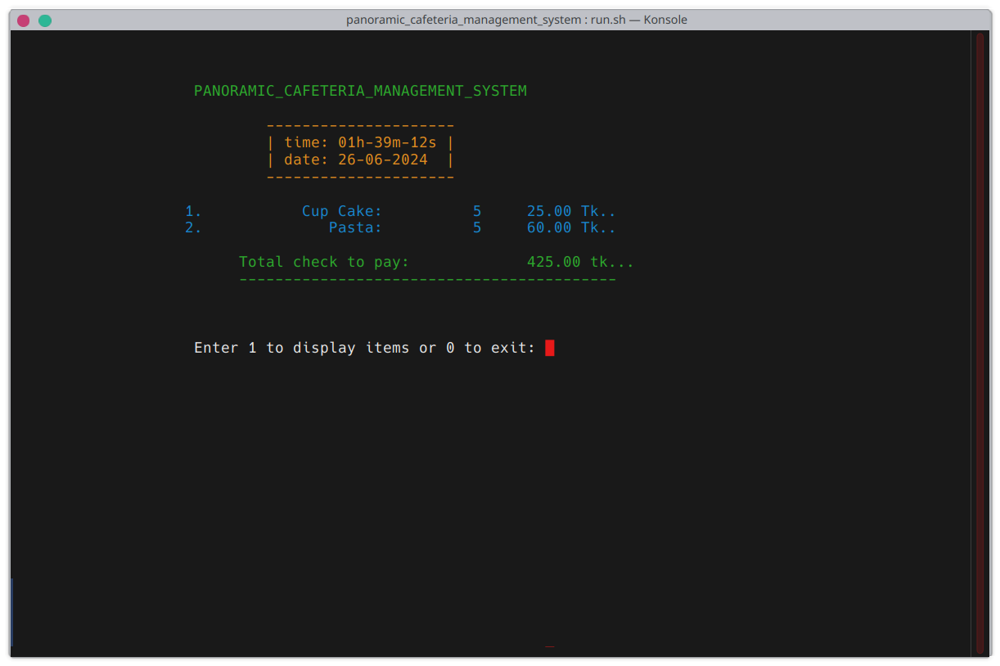
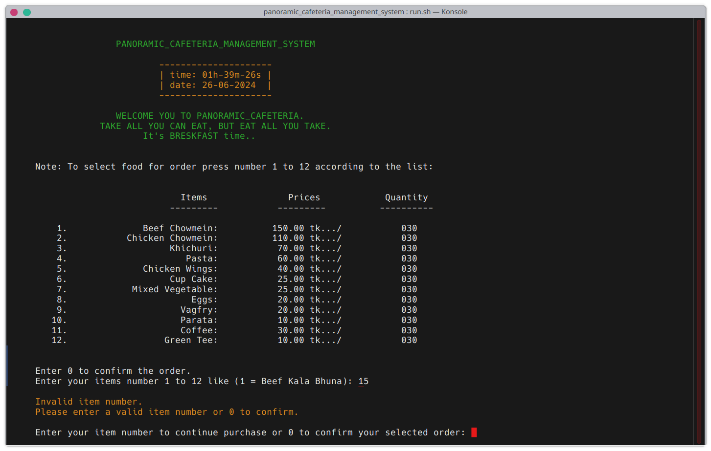
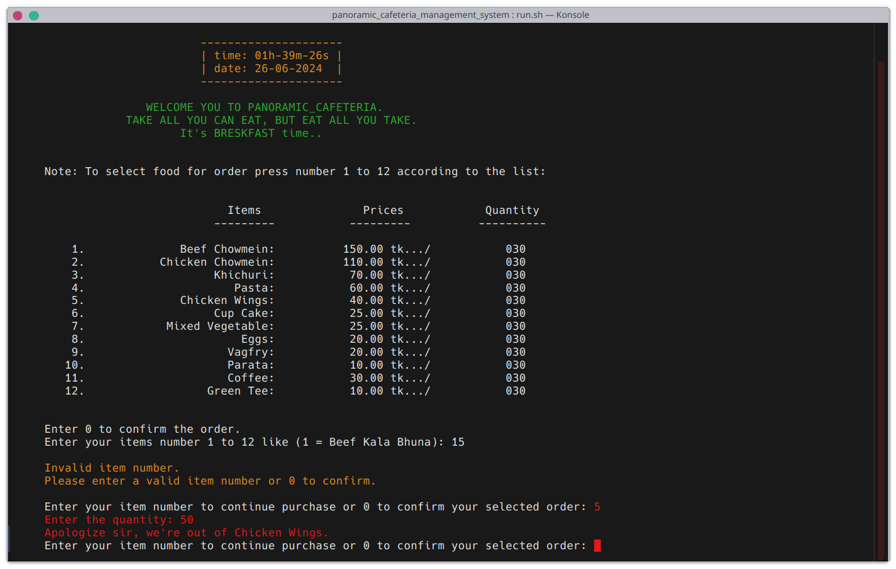
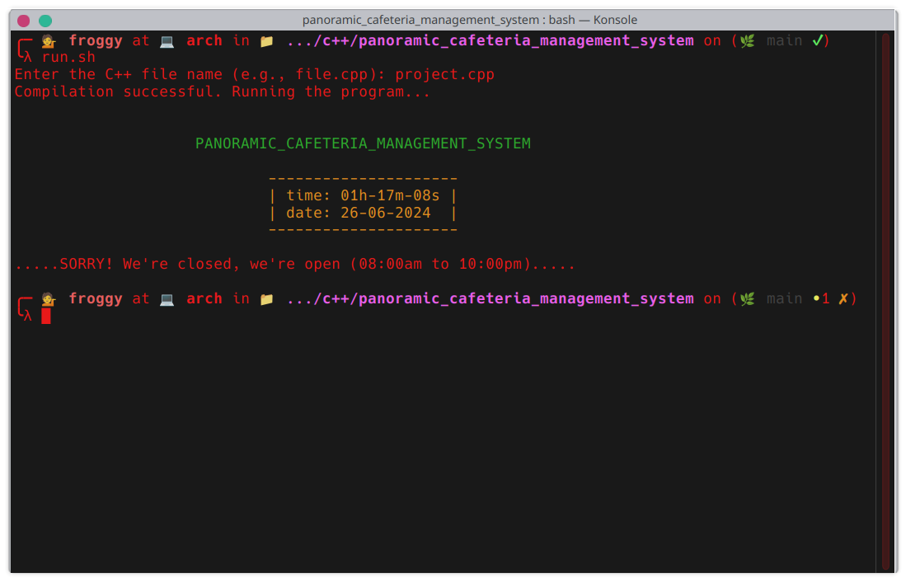

# panoramic_cafeteria_management_system


Morshed Sazin<br/>
# Cafe Control Application

Welcome to the Cafe Control Application repository! This project is a simple yet powerful application designed to assist cafe owners and managers in efficiently managing their daily operations.

## Features

- **Order Management:** Easily take and manage customer orders.
- **Inventory Tracking:** Keep track of stock levels and manage inventory efficiently.
- **Billing and Payments:** Streamline the billing process and manage payments seamlessly.
- **User-Friendly Interface:** Designed with a straightforward interface for ease of use.

## Purpose

The purpose of this application is to provide a foundational tool for cafe owners or managers to streamline their daily operations. Whether you're handling customer orders, managing inventory, or processing payments, this application aims to simplify these tasks and improve operational efficiency.

## Getting Started

To get started with the Cafe Control Application, follow these steps:

1. **Clone the repository:**
   ```bash
   git clone https://github.com/MorshedSazin/panoramic_cafeteria_management_system.git 

<!--  -->










| media        | address                  |
| ------------ | ---------------------- |
| Facebook | https://www.facebook.com/MorshedSazin/          |
| linkdin  | https://www.linkedin.com/in/morshed-sazin-8743821b8/ |
| mail     | morshedsazin@gmail.com           |
